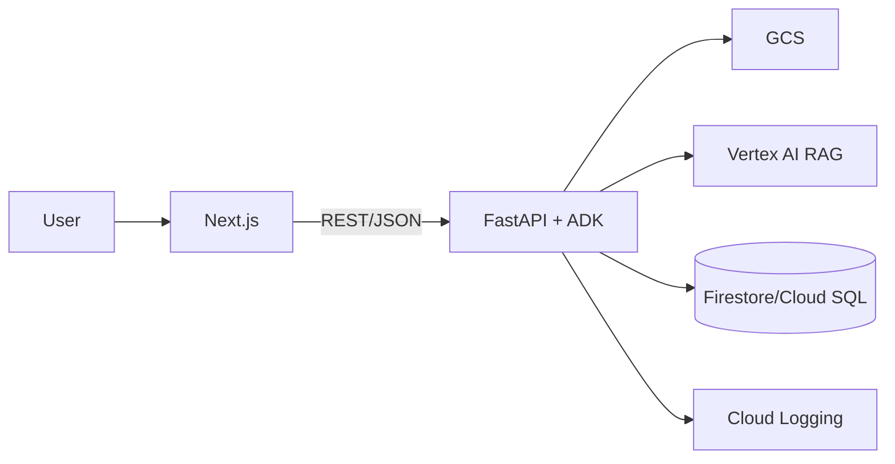

# 目的（What & Why）

* **What**: 新クトゥルフTRPG（CoC7版）のシナリオをアップロードし、AIエージェント（KP/複数PL）が自走プレイ→フィードバックを返すWebアプリの**MVP**を構築する。
* **Why**: シナリオの「テンポ/分岐/難易度/理不尽度」を自動検証し、改善ループを高速化する。
* **Audience**: コード生成エージェント（Codex CLI等）と人間開発者。**機械可読性**と**誤操作抑止**を重視。

---

# スコープ（MVP）

* CoC7固定（D100判定・ボーナス/ペナルティ・SANチェックの基本）
* 役割: **Keeper**（KP）, **Player[N]**（PL, 性格プロファイル付き）, **Evaluator**（自動講評）, **Orchestrator**（進行）
* ファイル: シナリオ（PDF/MD/TXT）アップロード→段落分割→RAG検索
* 画面: アップロード / 性格スライダ / キャラシ作成（ランダム・ポイント振り・JSONインポート）/ 実行 / ライブログ / フィードバック
* 参照: PL/KPからキャラシを即時参照（Snapshot表示）

**非スコープ（MVP）**: マルチセッション同時実行の最適化、ネット越し協調編集、完全な対抗判定網羅、戦闘ラウンド完全実装、課金。

---

# システム構成（最小）

* **Frontend**: Next.js(>=14) + TypeScript, App Router, Tailwind, API Routes or BFF
* **Backend**: Python 3.12 + Google ADK（Agents/Tools/Orchestrator）, FastAPI
* **Storage**: Firestore（PoC）/ Cloud SQL（将来移行）; GCS for uploads; Vertex AI RAG Engine（コーパス）
* **Deploy**: Cloud Run（FE/BE分離）+ Artifact Registry + Cloud Build, Secret Manager
* **Auth**: Firebase Auth（メールリンク or Google）
  * `FIREBASE_AUTH_DISABLED=0` で有効化。`FIREBASE_PROJECT_ID` とサービスアカウント or ADC を用意。



---

# ディレクトリ構成（モノレポ推奨）

```
repo/
  apps/
    web/          # Next.js
    api/          # FastAPI + ADK
  packages/
    schema/       # zod/Pydantic共有定義
    ui/           # 共通UIコンポーネント
  infra/
    docker/       # Dockerfiles
    gcp/          # IaC (後日)
  .tool-params/   # エージェント生成用定数（AI参照用）
```

---

# 共有スキーマ（AIフレンドリー JSON Schema; 抜粋）

```json
{
  "$schema": "https://json-schema.org/draft/2020-12/schema",
  "$id": "https://example.com/schema/characters.json",
  "title": "Character",
  "type": "object",
  "required": ["pc_name", "stats", "skills"],
  "properties": {
    "id": {"type": "string", "pattern": "^pc_[a-z0-9]{6,}$"},
    "pc_name": {"type": "string", "minLength": 1},
    "meta": {"type": "object", "properties": {"era": {"type": "string"}, "profession": {"type": "string"}}},
    "stats": {"type": "object", "required": ["STR","CON","SIZ","DEX","APP","INT","POW","EDU"],
      "properties": {
        "STR": {"type": "integer", "minimum": 5, "maximum": 99},
        "CON": {"type": "integer"},
        "SIZ": {"type": "integer"},
        "DEX": {"type": "integer"},
        "APP": {"type": "integer"},
        "INT": {"type": "integer"},
        "POW": {"type": "integer"},
        "EDU": {"type": "integer"}
      }
    },
    "derived": {"type": "object", "properties": {
      "HP": {"type":"integer"}, "MP": {"type":"integer"}, "SAN": {"type":"integer"},
      "Luck": {"type":"integer"}, "Build": {"type":"integer"}, "DB": {"type":"string"}, "Move": {"type":"integer"}
    }},
    "skills": {"type": "object", "additionalProperties": {"type": "integer", "minimum": 0, "maximum": 99}},
    "inventory": {"type": "array", "items": {"type": "string"}}
  }
}
```

```json
{
  "$schema": "https://json-schema.org/draft/2020-12/schema",
  "$id": "https://example.com/schema/scenario-structure.json",
  "title": "ScenarioStructure",
  "type": "object",
  "required": ["scenario_id", "scenes"],
  "properties": {
    "scenario_id": {"type": "string"},
    "phases": {
      "type": "array",
      "items": {"enum": ["hook", "investigation", "confrontation", "aftermath"]}
    },
    "scenes": {
      "type": "array",
      "items": {
        "type": "object",
        "required": ["scene_id", "title", "phase", "summary"],
        "properties": {
          "scene_id": {"type": "string", "pattern": "^scene_[a-z0-9]{6,}$"},
          "title": {"type": "string"},
          "phase": {"type": "string", "enum": ["hook", "investigation", "confrontation", "aftermath"]},
          "summary": {"type": "string"},
          "objectives": {"type": "array", "items": {"type": "string"}},
          "entry_conditions": {"type": "array", "items": {"type": "string"}},
          "exit_links": {"type": "array", "items": {"type": "string"}},
          "featured_npcs": {"type": "array", "items": {"type": "string"}},
          "clues": {"type": "array", "items": {"type": "string"}},
          "risk_level": {"type": "string", "enum": ["low", "medium", "high"]},
          "recommended_checks": {
            "type": "array",
            "items": {
              "type": "object",
              "required": ["skill", "difficulty"],
              "properties": {
                "skill": {"type": "string"},
                "difficulty": {"type": "string", "enum": ["regular", "hard", "extreme"]},
                "consequences": {"type": "string"}
              }
            }
          }
        }
      }
    },
    "npcs": {
      "type": "array",
      "items": {
        "type": "object",
        "required": ["npc_id", "name", "faction"],
        "properties": {
          "npc_id": {"type": "string", "pattern": "^npc_[a-z0-9]{6,}$"},
          "name": {"type": "string"},
          "faction": {"type": "string", "enum": ["ally", "neutral", "antagonist", "unknown"]},
          "motivation": {"type": "string"},
          "stats": {"type": "object", "additionalProperties": {"type": "integer"}},
          "visibility": {"type": "string", "enum": ["public", "secret"]},
          "linked_scenes": {"type": "array", "items": {"type": "string"}},
          "notes": {"type": "string"}
        }
      }
    },
    "clues": {
      "type": "array",
      "items": {
        "type": "object",
        "required": ["clue_id", "description"],
        "properties": {
          "clue_id": {"type": "string", "pattern": "^clue_[a-z0-9]{6,}$"},
          "description": {"type": "string"},
          "discovery_methods": {"type": "array", "items": {"type": "string"}},
          "required_checks": {"type": "array", "items": {"type": "string"}},
          "related_npcs": {"type": "array", "items": {"type": "string"}},
          "story_impact": {"type": "string"}
        }
      }
    }
  }
}
```

---

# REST API（バックエンド）

**共通**: `Content-Type: application/json` / `Authorization: Bearer <token>`

## Characters

* `POST /v1/characters` — 生成（`method: random|point_buy|import`）
* `GET /v1/characters/{id}` — 取得
* `PATCH /v1/characters/{id}` — 差分更新
* `GET /v1/characters/{id}/snapshot` — 参照用サマリ

## Personalities

* `PUT /v1/personalities/{character_id}` — ベクトル保存
* `GET /v1/personalities/{character_id}` — 取得

## Sessions

* `POST /v1/sessions` — 実行開始（`scenario_id, party_ids[], seed, max_turns`）
* `GET /v1/sessions/{id}/turns?cursor=...` — ライブログ
* `GET /v1/sessions/{id}/feedback` — 評価

## Rolls（デバッグ/ツール直叩き）

* `POST /v1/rolls` — `{expr:"1d100", bonus: -1, skill: 65}`

**レスポンス例（/rolls）**

```json
{
  "expr":"1d100",
  "rolls":[37],
  "thresholds":{"regular":65,"hard":33,"extreme":13},
  "result":"Success","is_crit":false,"is_fumble":false
}
```

## Scenario Metadata（planned）

* `POST /v1/scenarios/{id}/structure` — シーン/NPC/手掛かりメタデータの初期登録（アップロード完了後にキック）
* `GET /v1/scenarios/{id}/structure` — 最新メタデータの取得（エージェント/フロント参照）
* `PATCH /v1/scenarios/{id}/structure` — Keeper向け修正（シーン順、自動抽出結果の補正）
* `POST /v1/scenarios/{id}/structure/validate` — メタデータ整合性チェック（孤立シーン、未参照NPC等）

---

# シナリオ構造化パイプライン計画

* 入力前処理: シナリオ（MD/PDF/TXT）をPandoc等でMarkdown正規化 → 章/節の見出し階層と箇条書きを抽出。
* ハイブリッド抽出: ルールベース（見出し・キーワード・判定表記）で候補シーン/NPC/アイテムをリスト化し、LLM補助で要約・タグ付け（phase/objectives/clues）。
* フェーズ割当: Hook/Investigation/Confrontation/Aftermathのいずれかを自動判定。導入フック（依頼/発端）やクライマックスの脅威記述、余韻パートの後処理を抽出し、失敗時のバックアップルート（フォールバック手掛かり）もマークする。
* 手掛かり連結: Clueごとに「発見方法」「関連シーン」「必要技能/難易度」を構造化し、複数経路で再取得できるよう `discovery_methods` を保持。
* NPC/ファクション: NPCの陣営・動機・秘匿情報を抽出。公開/秘匿フラグに応じてKeeperプロンプト配布を制御。
* 検証ジョブ: `structure/validate` APIでグラフ整合性（孤立ノード、閉路、未終端）とメタ情報の必須フィールドをチェック。失敗時はUIに修正タスク表示。
* UIワークフロー: アップロード後に構造化結果をカード表示し、Keeperがシーン順序変更、難易度調整、手掛かりラベル追記を行う編集モードを提供。保存時にRAGインデックスとメタデータを同期。
* 運用: 解析ログ・判定統計をCloud Loggingへ送出し、抽出精度を継続計測。KPI: シーン誤分類率 < 10%、手掛かり欠落率 < 5%。

---

# データモデル（Firestore; MVP）

```
collections:
  characters/{id}
  personalities/{character_id}
  scenarios/{id}  # { gcs_uri, parsed:{ok, chunks}, meta }
  scenario_structures/{scenario_id}  # { phases, scenes[], npcs[], clues[], validation }
  sessions/{id}
    turns/{turn_no}  # {speaker, utterance, dice, citations, snapshots}
  feedback/{session_id}  # [{dimension, score, comment}]
```

---

# ADK: Agents & Tools（実装規約）

* **命名**: `tools.dice.DiceTool`, `tools.rag.RagTool`, `tools.charsheet.CharSheetTool`, `tools.personality.PersonalityTool`
* **I/O**: すべて**JSON安全**な辞書を返す（文字列化不要）。
* **プロンプト**は `.tool-params/prompts/*.md` に分離し、**環境差替**を容易に。

## Keeper（KP）

* ルール: RAGの根拠外ネタバレ禁止 / 判定は「技能+難易度の宣言→DiceTool→描写」
* SANチェック: しきい値・減少量の計算のみ。描写は簡潔。

## Player（PL）

* 毎ターン `PersonalityTool.guidance` を内部参照。
* **一行アクション原則**: 行動（1文）→根拠（1文）→必要なら技能提示。

## Evaluator

* 指標: プロット整合性/テンポ/明確さ/緊張/公平性/能動性（0–5）+総評。
* 参照: 特定ターンの引用を付与（根拠）。

## Orchestrator

* ループ: `for turn in 1..T: players act -> keeper adjudicate`。
* 終了: シーン到達/時間/上限T。

## エージェント拡張ガイドライン（次期）

* シーン駆動: シナリオは「導入（Hook）→調査（Investigation）→対決（Confrontation）→余韻（Aftermath）」の層構造を意識し、各ターンで現在シーンの目的・鍵情報・危険度を参照して行動する。
* 手掛かり経路: 手掛かりは複数経路で取得できる構造を保持し、失敗時フォロー（追加手掛かり・アイデアロール提示）を自動化。
* NPC指向: NPCには動機/陣営/情報公開レベルを付与し、シーンごとに更新される「スタンス」を保持。Keeperはこのメタ情報を参照してリアクションを一貫化。
* 判定フロー: 判定要求は「技能名 + 難易度宣言 → DiceTool → 結果描写」を必須化し、失敗時のコンシークエンス分岐を事前に Scene meta に記述。
* ロールプロンプト: Player/Keeper/Evaluatorそれぞれのプロンプトにシーン情報・手掛かり進捗・危険度を注入し、性格スライダや温度パラメータを制御可能にする。

---

# ダイス/判定（CoC7）

* d100 + **ボーナス/ペナルティ**（十の位ダイスを複数振って採用）
* 成功段階: Regular/Hard/Extreme（しきい値=技能値, ⌊技能/2⌋, ⌊技能/5⌋）
* クリ/ファンブル: 01 / 100（ハウスルール可）

---

# セキュリティ/権限

* 最小権限SA（GCS read/write, Firestore, VertexAI: search/read）。
* PDFはGCS Private; 署名URLで短時間取得。
* 秘密: Secret Manager（API keys）。

---

# 観測可能性

* すべてのツール呼出を構造化ログ化 `{agent, tool, args, ms, session_id}`。
* 乱数seedとRAGクエリ/応答を**追跡ID**で紐付け（再現性）。

---

# エラーハンドリング規約

* **4xx**: バリデーション/権限。**5xx**: 依存障害。メッセージは機械/人両対応文。
* リトライ方針: RAGとGCSは指数バックオフ（最大3回）。

---

# 受け入れ基準（MVP）

* シナリオMDをアップロード→5〜10ターンの自走会話が**100%**で完了。
* ライブログに**判定結果**と**RAG引用**が表示される。
* PL/KPから任意PCのSnapshotを**≤300ms**で取得。
* フィードバックJSONに**6指標**+総評が入る。

---

# API契約テスト（サンプル）

* `POST /v1/characters` ランダム生成 → `GET` 整合
* `PUT /v1/personalities/{id}` → `GET` 一致
* `POST /v1/rolls` bonus=+1/-1 の境界テスト
* `POST /v1/sessions` → 10ターン以内に`/feedback`取得

---

# デプロイ要件

* **Docker**: `infra/docker/api.Dockerfile`, `infra/docker/web.Dockerfile`
* **Cloud Run**: `--cpu=1 --memory=1Gi --min-instances=0`（MVP）
* **CI**: Cloud Build; mainへmergeで`staging`に自動デプロイ

---

# コーディング規約

* Back: Ruff + Black; typing必須; FastAPIで`/docs`
* Front: ESLint + Prettier; zodでAPIバリデーション

---

# リスクと回避

* **RAG過信**: Keeperの越権防止プロンプト、引用強制
* **行動多様性不足**: 性格温度/探索方針のノイズ注入
* **PDF品質**: まずMD/TXT優先、PDFはOCRを後回し

---

# 変更容易性

* ルール差替: DiceToolと判定表を分離
* DB移行: Firestore→Cloud SQLはDAO層差替

---

# アジャイル計画書（スプリント型; MVP最優先）

## スプリント0（1–2日）— 基盤

**ゴール**: リポ/モノレポ、CI、ラン環境、雛形。

* [x] repo初期化（apps/web, apps/api, packages/schema）
* [x] Dockerfile ×2 作成
* [x] FastAPI 雛形 `/healthz`
* [x] Next.js 雛形 `/upload`
* [x] 共通Schema置き場と型共有
* **Done条件**: `docker compose up`でFE/BEが起動

## スプリント1（2–3日）— キャラシ & ダイス

**ゴール**: キャラ作成/参照APIとd100実装。

* [x] `POST /v1/characters`（random, point_buy stub）
* [x] 由来値計算（HP/MP/SAN/Build/DB/Move）
* [x] `GET /characters/{id}/snapshot`
* [x] `POST /v1/rolls`（bonus/penalty、成功段階）
* **Done条件**: FEから作成→参照→ロールが通る

## スプリント2（2–3日）— 性格設定 & PL/KP

**ゴール**: PersonalityTool + Player/Keeper最小会話。

* [x] `PUT/GET /v1/personalities/{id}`
* [x] Playerエージェントがguidanceを内部参照
* [x] Keeperがロール→描写の骨組み
* **Done条件**: 人工シーンで5ターン回る

## スプリント3（3–4日）— RAG & シナリオ実行

**ゴール**: アップロード→段落化→RAG→自走。

* [x] アップロード→GCS保存→インデクシング
* [x] `RagTool.retrieve()` 実装
* [x] OrchestratorでRAG引用をログ化
* **Done条件**: 短いMDシナリオで10ターン完走

## スプリント4（2–3日）— フィードバック

**ゴール**: Evaluatorで6指標+総評。

* [x] ログ→評価JSON→`/feedback`
* [x] FEダッシュボード表示
* **Done条件**: 3つのシナリオで評価生成

## スプリント5（2–3日）— 仕上げ

**ゴール**: 認証/監視/リリース。

* [ ] Firebase Auth（匿名→メール）
* [x] 構造化ログと追跡ID
* [x] Staging→Prodプロモート
* **Done条件**: 本番URLでMVP要件充足

## スプリント6（3–4日）— エージェント本実装

**ゴール**: LLMベースのKP/PLエージェントで実用的なログを生成。

* [ ] Vertex AI / OpenAI等への接続基盤（APIキー管理、リトライ、タイムアウト）
* [ ] Keeper／Player向けプロンプトテンプレートの整備と性格スライダの反映
* [ ] 行動に伴うダイス判定（`POST /v1/rolls`）とログへの組み込み
* [ ] シーン/フェーズ情報を共有するステート管理（現在シーン、未取得手掛かり、危険度）
* [ ] Keeper/PlayerがScene metaに記述された"objectives" "recommended_checks"を参照して行動・トランジションを決定
* [ ] セッションループの再設計（行動選択、終了条件、例外処理）とバックアップルート提示（アイデアロール等）
* **Done条件**: サンプルシナリオでLLM生成のログが10ターン以上継続し、引用と判定が含まれる

## スプリント7（2–3日）— 品質強化とガードレール

**ゴール**: 出力品質と安定性を向上し、E2E動作を保証。

* [ ] 評価メトリクスの精緻化（LLM評価テンプレート、閾値、失敗時再試行）
* [ ] セッションログ／チャンクの保持方針とクリーンアップジョブ
* [ ] 失敗検知・通知（構造化ログのアラート、Webhook等）
* [ ] シナリオメタデータの自動検証（孤立シーン、未使用NPC、未結線手掛かり）をCI/管理画面に組み込み
* [ ] フロントE2Eテスト（Playwright等）による回帰チェック
* **Done条件**: ステージングで3シナリオ連続実行し、異常なくフィードバック出力

## スプリント8（3–4日）— シナリオ構造化 & メタデータ整備

**ゴール**: アップロードされたシナリオをシーン単位で整理し、TRPG特有のメタ情報（NPC、手掛かり、アイテム、進行ライン）を保持できるようにする。新クトゥルフTRPGのドメイン知識に基づき、解析結果をAIエージェントが利用できる形にする。

* [ ] ドメイン調査：海外／国内の新クトゥルフTRPGシナリオ構成、Keeper向けガイドライン（例：導入→調査→クライマックス、ハンドアウト、技能判定ポイント、NPCステータス）を整理し、引用元をSPECに追記
* [ ] メタデータスキーマ設計：`Scene`（目的、トリガー、遷移先）、`NPC`（役割、陣営、ステータス、動機）、`Clue/Item`（取得条件、関連シーン）などを JSON Schema として定義
* [ ] シナリオ解析パイプライン強化：Markdown/テキストの構造化（見出し→シーン抽出、タグ検出、手掛かりリスト化）。必要に応じて簡易ルールベースとLLM補助のハイブリッド処理を設計し、フェーズ分類（Hook/Investigation/Confrontation/Aftermath）とバックアップルート抽出を実装
* [ ] Keeper向け編集UI/API：抽出結果の手動修正（シーン順の編集、NPC属性の追記、アイテム管理）、RAGコーパスへの反映フローを用意
* [ ] `structure/validate` の整合性チェック基準（孤立シーン、未参照NPC、手掛かり未到達時の救済策）を定義し、自動検証ジョブとして実装
* [ ] エージェント連携：メタデータを `SessionGenerator` / `agents` へ供給し、シーンごとの目標やNPC情報を参照できる形に拡張（未実装ならタスク化）
* **Done条件**: サンプルシナリオをアップロードすると、Scene/NPC/Clue/Item/StoryLineが自動抽出され、UIで確認・修正・保存できる

---

# エージェント開発ロードマップ（詳細）

- **フェーズA: MVP安定化** — 既存セッションループのLLM置換に備え、DiceTool/PersonalityTool/ログ構造の整合性テストを整備。
- **フェーズB: シーン感応プロンプト** — Scene metaを参照するKeeper/Playerプロンプトを策定し、Hook→Investigation→Confrontation→Aftermathの進行やアイデアロール等のフォールバック提示をテンプレート化。
- **フェーズC: 行動決定エンジン** — 各プレイヤーの性格ベクトルとScene objectivesを元に、行動候補を生成→評価→選択するスコアリング（期待SAN/危険度）を導入。ローリング結果を踏まえた次ターン計画を維持。
- **フェーズD: 評価フィードバック収束** — EvaluatorがScene metaとログ引用からテンポ/手掛かり回収率/緊張感を分析し、Keeper/Designer向け改善ポイントを提示。異常検知時はシナリオ構造の欠落（孤立シーン）を指摘。
- **フェーズE: ガードレール** — 禁止行動（ネタバレ、外部知識持ち込み）をプロンプト/ツール実装で制御し、セッション崩壊時のロールバックと再試行を自動化。

## 着手ブランチ計画（2025-11-03）

- `feature/scenario-structure-stub`
  - 対象: `ScenarioStructure` スキーマの packages/schema への切り出し、`/v1/scenarios/{id}/structure` 系 API の FastAPI スタブ実装（POST/GET/PATCH/validate のリクエスト/レスポンス型定義とルーティングのみ）。
  - 非対象: Firestore保存ロジック、解析パイプライン本体、UI 実装、RAG 連携、テスト自動化。
  - 完了条件: スタブエンドポイントが 200/202/400 系レスポンスを返す最小実装が追加され、OpenAPI 上で ScenarioStructure 型が参照できる状態。

# バックログ（優先順）

1. キャラシ**インポート**（ココフォリア/ユドナリウム）
2. 対抗判定/戦闘ラウンドの拡充
3. SANの一時/不定の狂気イベント表
4. 性格プリセットのGUI
5. エクスポート（CSV/JSON, 企画書添付用）

---

# Codex CLI向け 実行テンプレ（安全化）

## 変数（.tool-params/env.json）

```json
{
  "project": "trpg-autoplay",
  "region": "asia-northeast1",
  "gcs_bucket": "trpg-app-data",
  "services": {"web": "trpg-web", "api": "trpg-api"}
}
```

## 生成順序（高危険操作なし）

1. リポ雛形 → 2) API雛形 → 3) ダイス → 4) キャラ作成 → 5) 性格 → 6) RAG → 7) 実行/評価 → 8) デプロイ

## コマンド例（擬似）

```bash
# 1) 雛形
codex repo init --template monorepo

# 2) API
codex gen --path apps/api --preset fastapi-adk --routes /v1/characters,/v1/rolls,/v1/personalities,/v1/sessions

# 3) DiceTool
codex gen --path apps/api/tools/dice.py --spec .tool-params/dice_spec.yaml

# 4) Character APIs
codex gen --path apps/api/routes/characters.py --schema packages/schema/characters.json

# 5) Web
codex gen --path apps/web --preset next-upload-dashboard
```

---

# 仕様の機械可読（抜粋; YAML）

```yaml
roll:
  request:
    expr: {type: string, pattern: "^\\dd\\d+$"}
    bonus: {type: integer, minimum: -2, maximum: 2}
    skill: {type: integer, minimum: 1, maximum: 99}
  response:
    result: {enum: [Success, Hard, Extreme, Fail]}
    thresholds:
      regular: int
      hard: int
      extreme: int

personality:
  vector:
    risk_taking: {type: number, minimum: 0, maximum: 1}
    cooperation: {type: number, minimum: 0, maximum: 1}
    curiosity: {type: number, minimum: 0, maximum: 1}
    violence_avoidance: {type: number, minimum: 0, maximum: 1}
```

---

# テスト計画（要点）

* **ユニット**: DiceTool（境界/ボーナス）、Derived計算、RAGダミー
* **API契約**: OpenAPIとzodで相互検証
* **E2E（MVP）**: 固定seed/固定RAGで10ターン→フィードバック一致
* **負荷**: 1セッション並列×5でエラーなし

---

# 受け入れテスト手順（縮約）

1. `POST /v1/characters`（random）→200
2. `PUT /v1/personalities/{id}`→200
3. アップロード→シナリオID取得
4. `POST /v1/sessions`（max_turns=10）
5. `/turns`でRAG引用が含まれる
6. `/feedback`が6指標+総評を返す

---

# 付録：由来値計算（CoC7; 疑似）

* HP = floor((CON+SIZ)/10)
* MP = floor(POW/5)
* SAN = POW*5
* Build/DB = STR+SIZの閾値表により決定
* Move = DEX/STR/SIZ比較で決定

---

# 付録：プロンプト方針（最小）

* Keeper: 「技能+難易度→ロール→短い描写」
* Player: 「一行アクション→根拠→（必要時）技能名」
* Evaluator: JSON固定形式で返す

---

# 変更履歴

* v0.1 初稿（MVP向け設計/計画）
* v0.2 MVP雛形実装（FastAPI API / Next.jsダッシュボード / 共有スキーマ）
* v0.3 シナリオAPI強化（アップロード/一覧/簡易検索）とフロント連携、基本テスト整備
* v0.4 シナリオチャンク参照を用いたセッション生成・簡易RAGスタブ・Insights API を追加
* v0.5 Dockerコンテナ整備とチェックリスト更新
* v0.6 構造化ログ基盤とリクエストID連携を追加
* v0.7 Cloud Build パイプラインで Staging→Prod プロモート手順を定義
