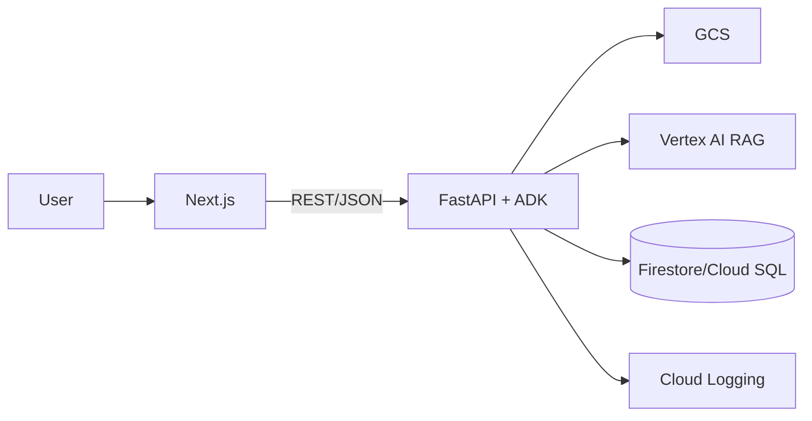

# 目的（What & Why）

* **What**: 新クトゥルフTRPG（CoC7版）のシナリオをアップロードし、AIエージェント（KP/複数PL）が自走プレイ→フィードバックを返すWebアプリの**MVP**を構築する。
* **Why**: シナリオの「テンポ/分岐/難易度/理不尽度」を自動検証し、改善ループを高速化する。
* **Audience**: コード生成エージェント（Codex CLI等）と人間開発者。**機械可読性**と**誤操作抑止**を重視。

---

# スコープ（MVP）

* CoC7固定（D100判定・ボーナス/ペナルティ・SANチェックの基本）
* 役割: **Keeper**（KP）, **Player[N]**（PL, 性格プロファイル付き）, **Evaluator**（自動講評）, **Orchestrator**（進行）
* ファイル: シナリオ（PDF/MD/TXT）アップロード→段落分割→RAG検索
* 画面: アップロード / 性格スライダ / キャラシ作成（ランダム・ポイント振り・JSONインポート）/ 実行 / ライブログ / フィードバック
* 参照: PL/KPからキャラシを即時参照（Snapshot表示）

**非スコープ（MVP）**: マルチセッション同時実行の最適化、ネット越し協調編集、完全な対抗判定網羅、戦闘ラウンド完全実装、課金。

---

# システム構成（最小）

* **Frontend**: Next.js(>=14) + TypeScript, App Router, Tailwind, API Routes or BFF
* **Backend**: Python 3.12 + Google ADK（Agents/Tools/Orchestrator）, FastAPI
* **Storage**: Firestore（PoC）/ Cloud SQL（将来移行）; GCS for uploads; Vertex AI RAG Engine（コーパス）
* **Deploy**: Cloud Run（FE/BE分離）+ Artifact Registry + Cloud Build, Secret Manager
* **Auth**: Firebase Auth（メールリンク or Google）



---

# ディレクトリ構成（モノレポ推奨）

```
repo/
  apps/
    web/          # Next.js
    api/          # FastAPI + ADK
  packages/
    schema/       # zod/Pydantic共有定義
    ui/           # 共通UIコンポーネント
  infra/
    docker/       # Dockerfiles
    gcp/          # IaC (後日)
  .tool-params/   # エージェント生成用定数（AI参照用）
```

---

# 共有スキーマ（AIフレンドリー JSON Schema; 抜粋）

```json
{
  "$schema": "https://json-schema.org/draft/2020-12/schema",
  "$id": "https://example.com/schema/characters.json",
  "title": "Character",
  "type": "object",
  "required": ["pc_name", "stats", "skills"],
  "properties": {
    "id": {"type": "string", "pattern": "^pc_[a-z0-9]{6,}$"},
    "pc_name": {"type": "string", "minLength": 1},
    "meta": {"type": "object", "properties": {"era": {"type": "string"}, "profession": {"type": "string"}}},
    "stats": {"type": "object", "required": ["STR","CON","SIZ","DEX","APP","INT","POW","EDU"],
      "properties": {
        "STR": {"type": "integer", "minimum": 5, "maximum": 99},
        "CON": {"type": "integer"},
        "SIZ": {"type": "integer"},
        "DEX": {"type": "integer"},
        "APP": {"type": "integer"},
        "INT": {"type": "integer"},
        "POW": {"type": "integer"},
        "EDU": {"type": "integer"}
      }
    },
    "derived": {"type": "object", "properties": {
      "HP": {"type":"integer"}, "MP": {"type":"integer"}, "SAN": {"type":"integer"},
      "Luck": {"type":"integer"}, "Build": {"type":"integer"}, "DB": {"type":"string"}, "Move": {"type":"integer"}
    }},
    "skills": {"type": "object", "additionalProperties": {"type": "integer", "minimum": 0, "maximum": 99}},
    "inventory": {"type": "array", "items": {"type": "string"}}
  }
}
```

---

# REST API（バックエンド）

**共通**: `Content-Type: application/json` / `Authorization: Bearer <token>`

## Characters

* `POST /v1/characters` — 生成（`method: random|point_buy|import`）
* `GET /v1/characters/{id}` — 取得
* `PATCH /v1/characters/{id}` — 差分更新
* `GET /v1/characters/{id}/snapshot` — 参照用サマリ

## Personalities

* `PUT /v1/personalities/{character_id}` — ベクトル保存
* `GET /v1/personalities/{character_id}` — 取得

## Sessions

* `POST /v1/sessions` — 実行開始（`scenario_id, party_ids[], seed, max_turns`）
* `GET /v1/sessions/{id}/turns?cursor=...` — ライブログ
* `GET /v1/sessions/{id}/feedback` — 評価

## Rolls（デバッグ/ツール直叩き）

* `POST /v1/rolls` — `{expr:"1d100", bonus: -1, skill: 65}`

**レスポンス例（/rolls）**

```json
{
  "expr":"1d100",
  "rolls":[37],
  "thresholds":{"regular":65,"hard":33,"extreme":13},
  "result":"Success","is_crit":false,"is_fumble":false
}
```

---

# データモデル（Firestore; MVP）

```
collections:
  characters/{id}
  personalities/{character_id}
  scenarios/{id}  # { gcs_uri, parsed:{ok, chunks}, meta }
  sessions/{id}
    turns/{turn_no}  # {speaker, utterance, dice, citations, snapshots}
  feedback/{session_id}  # [{dimension, score, comment}]
```

---

# ADK: Agents & Tools（実装規約）

* **命名**: `tools.dice.DiceTool`, `tools.rag.RagTool`, `tools.charsheet.CharSheetTool`, `tools.personality.PersonalityTool`
* **I/O**: すべて**JSON安全**な辞書を返す（文字列化不要）。
* **プロンプト**は `.tool-params/prompts/*.md` に分離し、**環境差替**を容易に。

## Keeper（KP）

* ルール: RAGの根拠外ネタバレ禁止 / 判定は「技能+難易度の宣言→DiceTool→描写」
* SANチェック: しきい値・減少量の計算のみ。描写は簡潔。

## Player（PL）

* 毎ターン `PersonalityTool.guidance` を内部参照。
* **一行アクション原則**: 行動（1文）→根拠（1文）→必要なら技能提示。

## Evaluator

* 指標: プロット整合性/テンポ/明確さ/緊張/公平性/能動性（0–5）+総評。
* 参照: 特定ターンの引用を付与（根拠）。

## Orchestrator

* ループ: `for turn in 1..T: players act -> keeper adjudicate`。
* 終了: シーン到達/時間/上限T。

---

# ダイス/判定（CoC7）

* d100 + **ボーナス/ペナルティ**（十の位ダイスを複数振って採用）
* 成功段階: Regular/Hard/Extreme（しきい値=技能値, ⌊技能/2⌋, ⌊技能/5⌋）
* クリ/ファンブル: 01 / 100（ハウスルール可）

---

# セキュリティ/権限

* 最小権限SA（GCS read/write, Firestore, VertexAI: search/read）。
* PDFはGCS Private; 署名URLで短時間取得。
* 秘密: Secret Manager（API keys）。

---

# 観測可能性

* すべてのツール呼出を構造化ログ化 `{agent, tool, args, ms, session_id}`。
* 乱数seedとRAGクエリ/応答を**追跡ID**で紐付け（再現性）。

---

# エラーハンドリング規約

* **4xx**: バリデーション/権限。**5xx**: 依存障害。メッセージは機械/人両対応文。
* リトライ方針: RAGとGCSは指数バックオフ（最大3回）。

---

# 受け入れ基準（MVP）

* シナリオMDをアップロード→5〜10ターンの自走会話が**100%**で完了。
* ライブログに**判定結果**と**RAG引用**が表示される。
* PL/KPから任意PCのSnapshotを**≤300ms**で取得。
* フィードバックJSONに**6指標**+総評が入る。

---

# API契約テスト（サンプル）

* `POST /v1/characters` ランダム生成 → `GET` 整合
* `PUT /v1/personalities/{id}` → `GET` 一致
* `POST /v1/rolls` bonus=+1/-1 の境界テスト
* `POST /v1/sessions` → 10ターン以内に`/feedback`取得

---

# デプロイ要件

* **Docker**: `apps/api/Dockerfile`, `apps/web/Dockerfile`
* **Cloud Run**: `--cpu=1 --memory=1Gi --min-instances=0`（MVP）
* **CI**: Cloud Build; mainへmergeで`staging`に自動デプロイ

---

# コーディング規約

* Back: Ruff + Black; typing必須; FastAPIで`/docs`
* Front: ESLint + Prettier; zodでAPIバリデーション

---

# リスクと回避

* **RAG過信**: Keeperの越権防止プロンプト、引用強制
* **行動多様性不足**: 性格温度/探索方針のノイズ注入
* **PDF品質**: まずMD/TXT優先、PDFはOCRを後回し

---

# 変更容易性

* ルール差替: DiceToolと判定表を分離
* DB移行: Firestore→Cloud SQLはDAO層差替

---

# アジャイル計画書（スプリント型; MVP最優先）

## スプリント0（1–2日）— 基盤

**ゴール**: リポ/モノレポ、CI、ラン環境、雛形。

* [ ] repo初期化（apps/web, apps/api, packages/schema）
* [ ] Dockerfile ×2 作成
* [ ] FastAPI 雛形 `/healthz`
* [ ] Next.js 雛形 `/upload`
* [ ] 共通Schema置き場と型共有
* **Done条件**: `docker compose up`でFE/BEが起動

## スプリント1（2–3日）— キャラシ & ダイス

**ゴール**: キャラ作成/参照APIとd100実装。

* [ ] `POST /v1/characters`（random, point_buy stub）
* [ ] 由来値計算（HP/MP/SAN/Build/DB/Move）
* [ ] `GET /characters/{id}/snapshot`
* [ ] `POST /v1/rolls`（bonus/penalty、成功段階）
* **Done条件**: FEから作成→参照→ロールが通る

## スプリント2（2–3日）— 性格設定 & PL/KP

**ゴール**: PersonalityTool + Player/Keeper最小会話。

* [ ] `PUT/GET /v1/personalities/{id}`
* [ ] Playerエージェントがguidanceを内部参照
* [ ] Keeperがロール→描写の骨組み
* **Done条件**: 人工シーンで5ターン回る

## スプリント3（3–4日）— RAG & シナリオ実行

**ゴール**: アップロード→段落化→RAG→自走。

* [ ] アップロード→GCS保存→インデクシング
* [ ] `RagTool.retrieve()` 実装
* [ ] OrchestratorでRAG引用をログ化
* **Done条件**: 短いMDシナリオで10ターン完走

## スプリント4（2–3日）— フィードバック

**ゴール**: Evaluatorで6指標+総評。

* [ ] ログ→評価JSON→`/feedback`
* [ ] FEダッシュボード表示
* **Done条件**: 3つのシナリオで評価生成

## スプリント5（2–3日）— 仕上げ

**ゴール**: 認証/監視/リリース。

* [ ] Firebase Auth（匿名→メール）
* [ ] 構造化ログと追跡ID
* *... content truncated due to length ...*